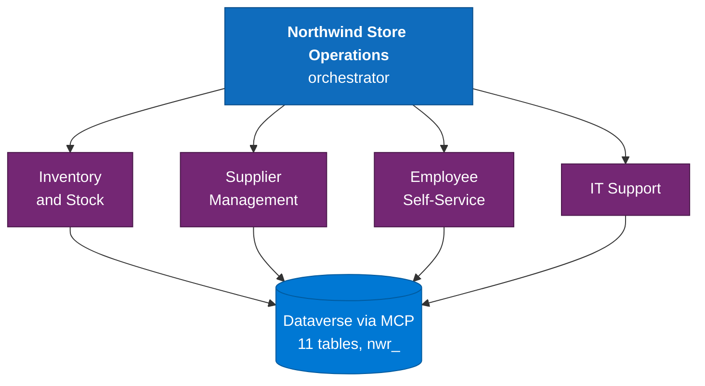
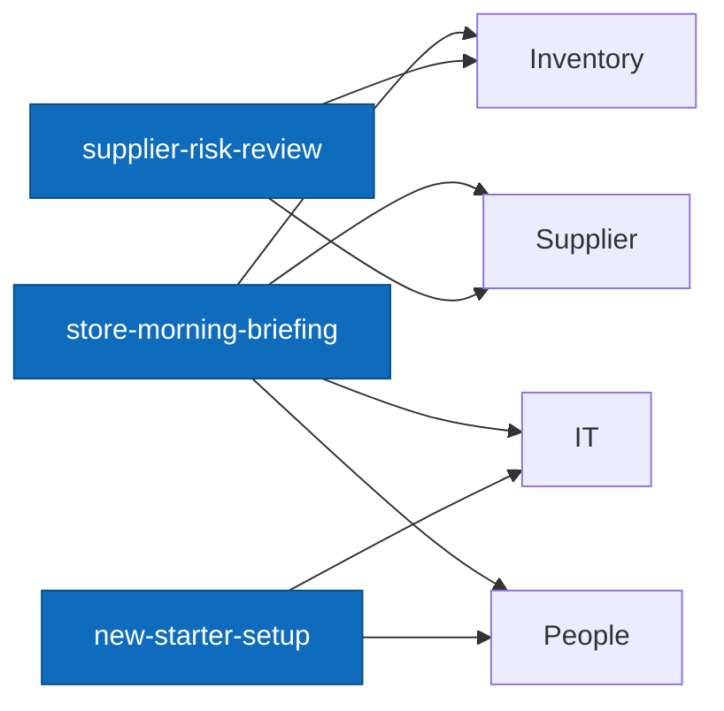

<div align="center">

# Copilot Retail Multi-Agent

**A reference implementation for multi-agent orchestration in Copilot Studio**

[](agents/)
[](skills/)
[](dataverse/)
[](#)
[](#disclaimer)
[](LICENSE)

</div>

An orchestrator, four domain agents, and six deliberately cross-cutting skills, grounded in
Dataverse through MCP.

Built around a fictitious retailer, **Northwind Retail Group**. One script rebrands the whole set
to your own schema.

---

## The problem

Most "multi-agent" demonstrations are one agent wearing several hats. They show the mechanics of
adding a child agent, but not the thing teams actually need to decide:

> **When does orchestration earn its complexity, and when is it just overhead?**

Without an answer, builds go one of two ways. Either four agents get created where one would have
done - and now every question routes badly, because four descriptions overlap and the orchestrator
picks arbitrarily. Or a single agent absorbs every domain until its instructions contradict
themselves and nobody can change one area without breaking another.

Both failures look identical from the outside: the agent answers confidently and wrongly.

## What this solves

| Problem | How this repo solves it |
|---|---|
| No clear test for when to split agents | A decision framework, with the single-agent counter-example |
| Orchestrator routes to the wrong child | Routing is driven by the child's `description`, not its name - documented with the two calls most often got wrong |
| Splitting domains loses cross-domain work | Six skills that each deliberately span two or three domains |
| Business rules buried in agent instructions | Domain rules live in skill steps, where they're testable and reusable |
| Agents invent numbers | Explicit "never invent" rules and exception-only reporting |
| Demo data that proves nothing | Every skill has a demo hook that lands on a real decision |

---

## What's in this repo

**This is a design reference and a skill set, not a deployable solution.**

| Included | Not included |
|---|---|
| Six skill packages (`SKILL.md` + zip), ready to upload | A packaged Power Platform solution |
| Orchestrator and child agent instructions and routing descriptions | Deployed agents - you create these in Copilot Studio |
| Dataverse schema documented as tables and columns | Table provisioning scripts |
| Rebranding script (tested) | Seeded demo data |
| Design rationale and setup guide | |

The skills are real, complete and uploadable. Everything else is documentation you follow to build
the agents yourself, following [docs/agent-setup.md](docs/agent-setup.md).

**Not verified:** no agent in this configuration has been deployed and routing-tested end to end as
part of this repo. The patterns come from a production multi-agent build; the specific skill set
here has not been run against a live orchestrator. Treat the routing test table in the setup guide
as the thing to run first, not as a result.

---

## Architecture



The six skills sit **across** the four agents, which is the part most designs miss:



| Skill | Domains it spans |
|---|---|
| `store-morning-briefing` | Inventory + Supplier + IT + People |
| `stock-transfer-request` | Inventory across two stores |
| `weekly-replenishment-plan` | Inventory + Supplier |
| `supplier-risk-review` | Supplier + Inventory |
| `major-incident-response` | IT + multi-store pattern |
| `new-starter-setup` | People + IT |

**That contrast is the point.** A single agent handles one domain well. No single *child* agent can
produce the morning briefing, because the briefing is the join.

---

## Quick start

1. Create the Dataverse tables - see [dataverse/README.md](dataverse/README.md).
2. Create the orchestrator and four child agents - see [docs/agent-setup.md](docs/agent-setup.md).
3. Rebrand the skills to your schema:

   ```powershell
   .\scripts\Set-SkillBranding.ps1 -Prefix con -RetailerName 'Contoso Retail' -Repackage
   ```

4. Upload each `skills/*.zip` via **Copilot Studio → Build → Skills → Add skill → Upload a skill**.

---

## Design decisions

### Routing is driven by `description`, not name

The orchestrator reads each child agent's **`description`** to decide where a question goes. It
matters more than the child agent's own instructions. If routing misfires, tune the description
first - changing the child's instructions will not fix it.

The same applies to skills: `description` in the front matter is what the router matches on. Keep
descriptions **specific and non-overlapping**, and say what the skill is *not* for.

Two routing calls that are consistently got wrong, and are worth encoding explicitly:
- **Damaged on arrival → Delivery, not Warranty.** Broke in transit ≠ failed in service.
- **"Is it in stock?" → Availability**, even when the customer already owns one.

### Business rules live in skills, not instructions

The rule that matters most in retail:

```
Available to sell = quantity on hand − quantity reserved
```

Reserved units belong to customers who have already paid. Quoting on-hand as sellable is how broken
promises start - and it is the single most common error in this domain.

That rule sits in the skill steps, not in agent instructions, because skills are versioned,
uploadable and testable in isolation. Instructions are for tone and scope.

### Child agents are purely generative

Child agents (`kind: AgentDialog`) cannot contain actions, so they cannot send adaptive cards.
Anything card-driven has to live in a parent topic. Plan for this before designing guided journeys.

### Exceptions only

A briefing that lists everything healthy does not get read. Every skill reports exceptions and
explicitly says when a section is clear, rather than padding it.

---

## When NOT to use orchestration

Multi-agent is not the default. Use **one agent** when:
- The domain is narrow enough that one set of instructions stays coherent.
- Users ask questions of one kind, and cross-domain joins aren't needed.
- You have fewer than roughly a dozen distinct tools or tables.

Splitting too early costs you routing accuracy - every additional child agent is another
description competing for the same question - and buys nothing.

Use **orchestration** when domains have genuinely different data, vocabulary and permissions, *and*
you have real workflows that span them. If you can't name three cross-cutting workflows, you
probably want one agent.

---

## Contents

| Path | Purpose |
|---|---|
| `skills/` | Six cross-cutting skills, folder + packaged `.zip` |
| `agents/` | Orchestrator and child agent instructions and descriptions |
| `dataverse/` | Table schema and provisioning |
| `docs/agent-setup.md` | Build order and configuration |
| `docs/design-rationale.md` | Single-agent vs orchestrator decision framework |
| `scripts/Set-SkillBranding.ps1` | Rebrands the skill set to your schema |

---

## Limitations
- **Skills upload one at a time** through the portal. There is no headless equivalent.
- **Connection binding is manual** - OAuth consent must be given once per environment in the portal.
- Skill `name` must be lowercase letters, numbers and hyphens, and must match the folder name.
- `SKILL.md` must sit at the **root** of the zip, not inside a folder.
- Written for the **new** Copilot Studio experience.

---

## Disclaimer

This is **sample code**, published as a reusable reference pattern.

- Provided **as is**, without warranty of any kind, express or implied. See [LICENSE](LICENSE).
- **Not production ready.** Treat it as a starting point, not a finished solution. Review, test and
  harden it against your own requirements before any real use.
- **Not an official Microsoft product** and not affiliated with, endorsed by, or supported by
  Microsoft. Product names are trademarks of their respective owners.
- **No support commitment.** Issues and pull requests are welcome, but nothing here carries an SLA.
- Some behaviours documented here rely on **undocumented or preview platform features** that can
  change without notice. Verify against current documentation before depending on them.
- You are responsible for security, privacy, licensing and regulatory compliance in your own
  environment.

---

## Licence

MIT - see [LICENSE](LICENSE).
